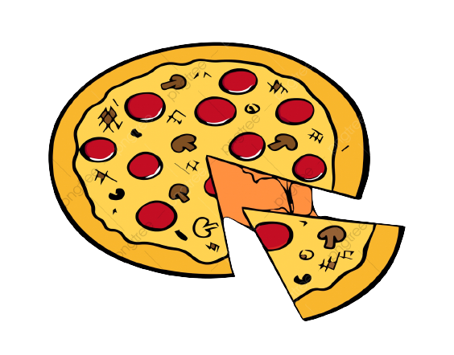
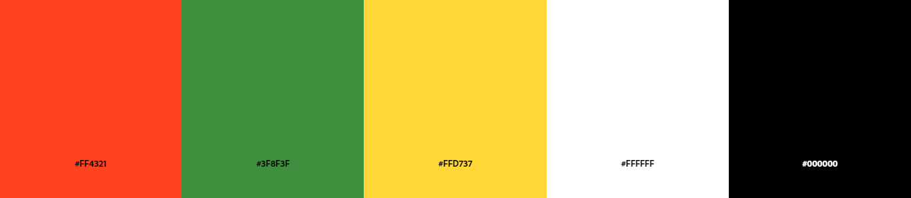
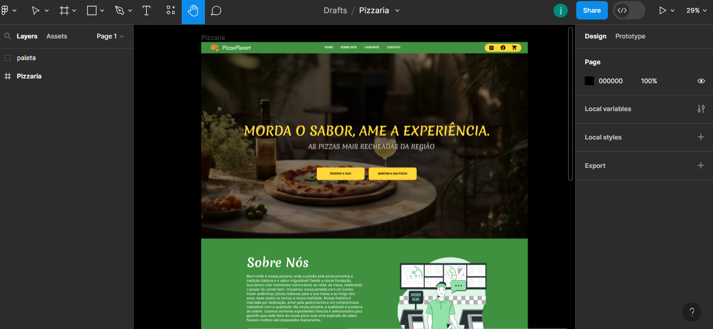
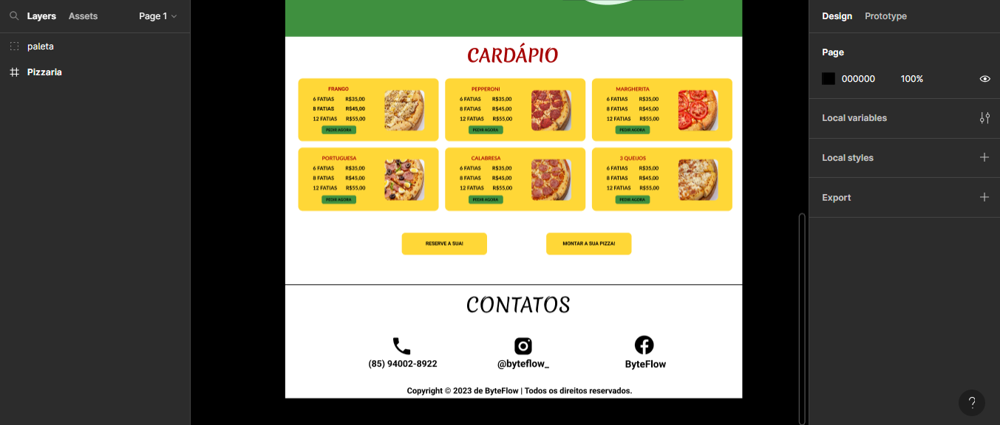
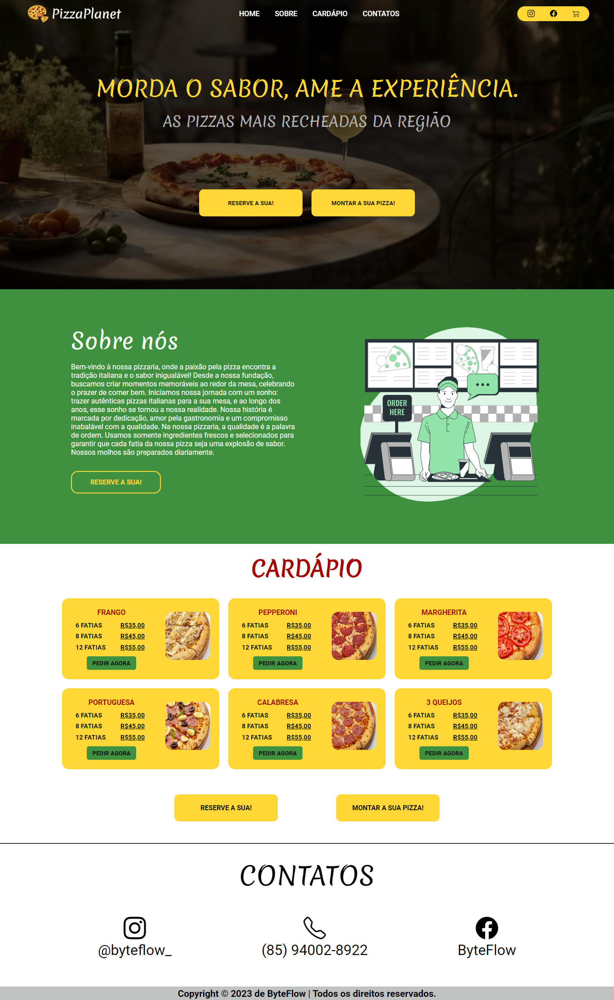
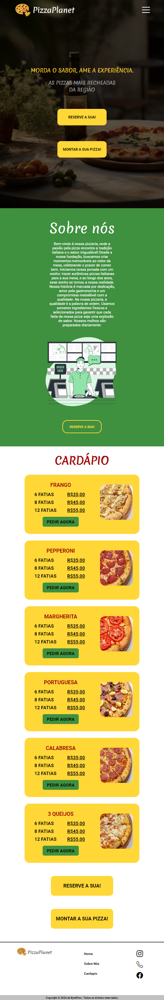

# Landing Page Pizzaria 🍕
✅​ Projeto Parcialmente concluido

 

## ​​​​🖥️​ Desenvolvido por: 
<ul>
<li>Jeovane Lima</li>
<li>Disponível em: <a href="https://jeovanesilva.github.io/Site_Pizzaria/" target="_blank">Site_Pizzaria</a></li>
</ul>

 

## ​⚒️​ Ferramentas Utilizadas:

 
 

<ul>
  <li>HTML</li>
  <li>CSS</li>
  <li>JavaScript</li>
  <li>Figma</li>
</ul>

 

 
## ​​​ Sobre o Projeto:

O projeto da landing page de uma pizzaria surgiu para mostrar para os clientes da <a href="https://github.com/AgenciaByteFlow" target="_blank">ByteFlow</a> o nosso potencial e a qualidade do nosso trabalho. O projeto não está completo pois sempre a surgimento de novas ideias e de aprimoramentos, pois por se tratar do início do meu trabalho, tem muita coisa a melhorar.

 

## ​🔗 Imagens do Projeto:

 
<h1>Paleta de Cores</h1>

 

<h1> Designe no figma </h1>

 

 

<h1>Resultado Final  </h1>

 

<h1>Site Responsivo</h1>

 

## ​🚨Importante:
<ul>
<li>A landing Page é um projeto fictício,ou seja, as informações nele contidas são inventadas.</li>

<li>Imagens retiradas do <a href="https://br.freepik.com/" target="_blank">Freepik.</a></li>

<li>As fontes utilizadas foram <a href="https://fonts.google.com/specimen/Merienda?query=merienda" target="_blank">Merienda</a> e <a href="https://fonts.google.com/specimen/Roboto?query=roboto" target="_blank">Roboto</a>, ambas retiradas do <a href="https://fonts.google.com/" target="_blank">Google Fonts.</a> </li>

<li>Icons retirados do <a href="https://icons.getbootstrap.com/" target="_blank">Bootstrap Icons.</a></li>

<li>Inspiração: <a href="https://youtu.be/Uxm17PTHAZw?si=bpv0OZSiHTNs-2xH" target="_blank">CrisTech.</a></li>
</ul>

<!--https://dev.to/envoy_/150-badges-for-github-pnk--!>
